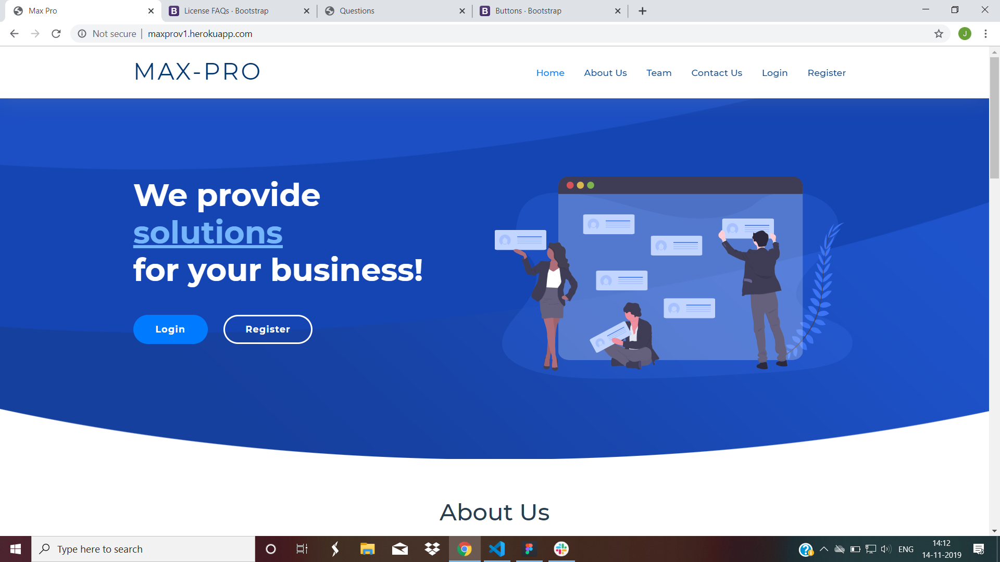
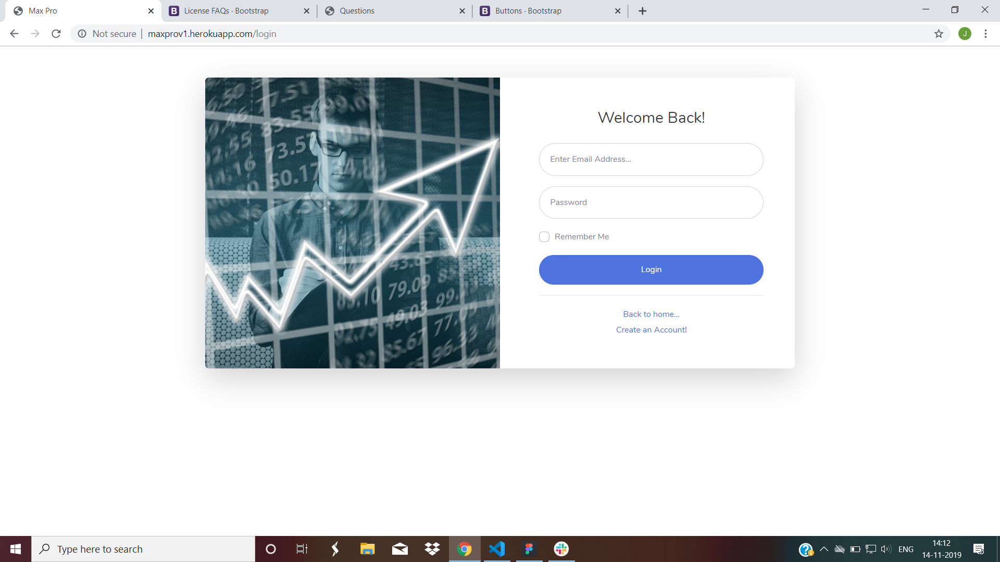
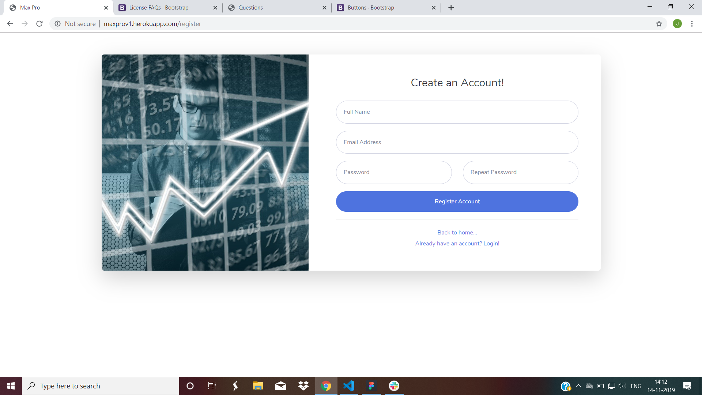
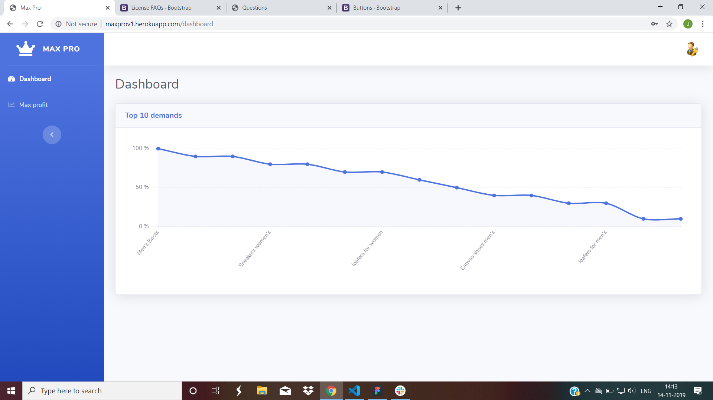
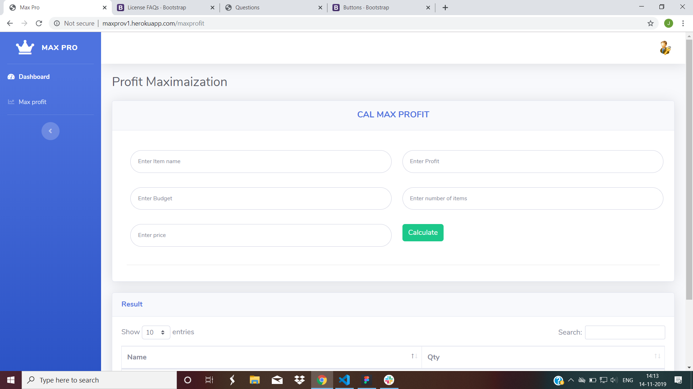

# Max-Pro
                                         Shaik Mudassir | Jashwanthi V
This is a MaxPro appication where retailer will get a shopping list to get maximum profit according to his budget.

**`Note: This application works only when there are high demand and less budget`**

## Technology used
+ HTML5
+ CSS
+ Bootsrap
+ JavaScript
+ MVC Handlebars
+ Node js
+ Mongodb 
+ Mongoose 
+ Express
+ Figma for design
## Guidelines

1. Each retailer have to register and login to application.

2. After logging in you will find the dashboard. 
   There we have genrated api of product demand fetching from Databasr.

3. goto maxpro section there You enter itemname,profit,price,demand sections.

4. The retailer have to enter data according to these sections.

5. Retailer have to enter data one by one separated by comma's.

6. After entering all the data you need to submit the data.

7. Then,you will get the list of items and quantity which you need to buy.

## Home page

## Login page

## Register page

## Dashboard

## result

| User name                | Password |
| ------------------------ | --------:|
| sh.mudassir98@gmail.com  | 123456   |

| **live demo** [click here](http://maxprov1.herokuapp.com/) | **video** [click here](https://youtu.be/eSi3MGR1d8c) |
|------------------------------------------------------------|------------------------------------------------------|
